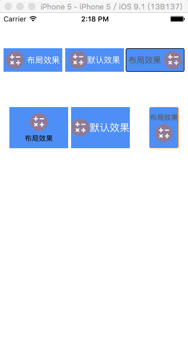

##介绍

使用Category，对UIButton进行扩展。不需要继承，放入即可使用。你可以使用UIButton的原生方法设置各个Status下的UI属性，而这个Category则为您提供布局的方法。
###图示


###提供方法
Cocoapods使用：`pod 'UIButton-LXLayout', '~> 0.1'`

+ 提供定制UIButton内部的imageView和titleLabel的位置的方法：

```objc
/**
 *  文本和图片间的间距
 */
@property (assign, nonatomic) CGFloat lx_subMargin;

/**
 *  布局的类型
 */
@property (assign, nonatomic) LXButtonLayoutType lx_layoutType;

/**
 *  对按钮内部的图片和文本重新进行布局
 *
 *  @param layoutType 重新布局的类型
 *  @param subMargin  内部图片和文本之间的间距
 */
- (void) lx_layoutWithType:(LXButtonLayoutType)layoutType subMargin:(CGFloat)subMargin;

```

+ 布局的类型有：

```objc
//UIButton重新布局的类型
typedef NS_ENUM(NSInteger, LXButtonLayoutType)
{
    LXButtonLayoutTypeNone                = 0,         //默认
    LXButtonLayoutTypeImageLeft           = 1,        //图片在左边
    LXButtonLayoutTypeImageRight          = 2,        //图片在右边
    LXButtonLayoutTypeImageTop            = 3,        //图片在上边
    LXButtonLayoutTypeImageBottom         = 4         //图片在下边
};
```

###实际使用
```
_button.lx_subMargin = 5;
_button.lx_layoutType = LXButtonLayoutTypeImageTop;
[_button setImage:[UIImage imageNamed:@"test_nor"] forState:UIControlStateNormal];
[_button setImage:[UIImage imageNamed:@"test_hl"] forState:UIControlStateHighlighted];
[_button setTitleColor:[UIColor whiteColor] forState:UIControlStateNormal];
[_button setTitleColor:[UIColor redColor] forState:UIControlStateHighlighted];
```


